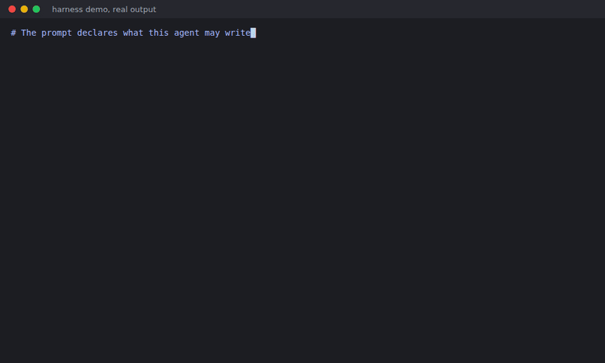
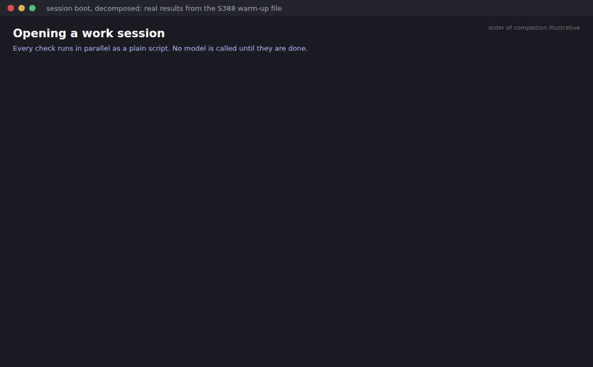
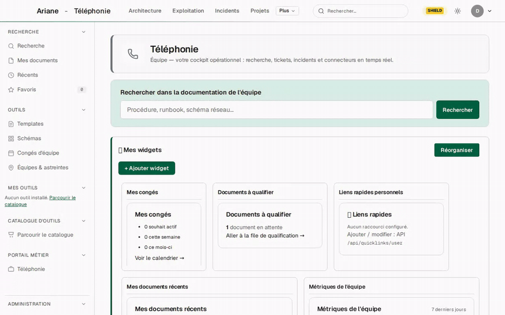
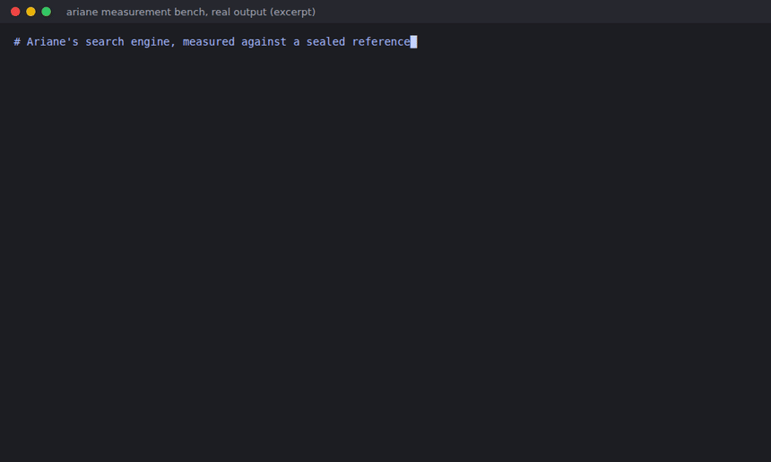
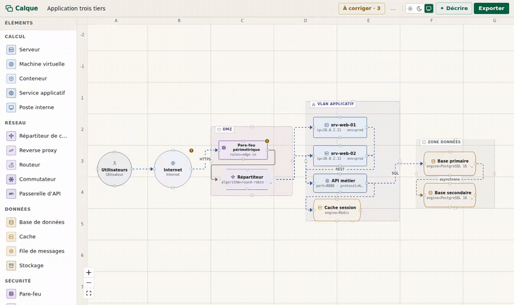
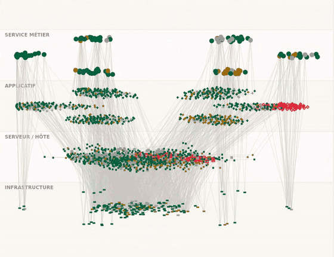
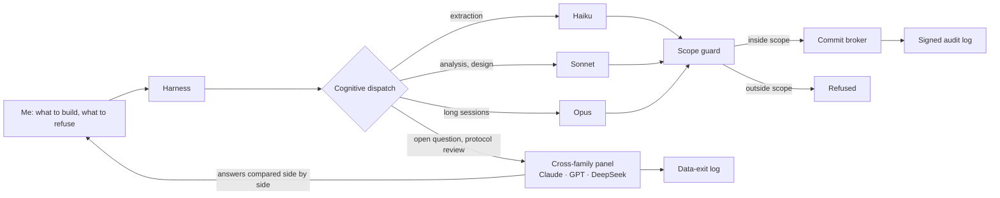

# Matteo Leonardi

**Applied AI engineer. I orchestrate coding agents, and I build the guardrails that make them safe
to trust.**

I spent eight years in a regulated bank taking systems designed elsewhere and making them hold in
the real world. Since 2026 I apply the same job to AI agents: I run my own multi-agent harness,
and I shipped eight products with it. Here are a few of them.

[labo-llm.fr](https://labo-llm.fr) · [LinkedIn](https://www.linkedin.com/in/matteo-l-35116a17a/) · Nantes, France · open to roles worldwide

---

## What I build

### The harness: agents that ask before they write



Every piece of work goes through it. It picks the right model for the job (Claude Code first,
Codex, DeepSeek or NVIDIA NIM when that is the better fit), gives each agent a scope it cannot
leave, lets only one writer touch git at a time, and records every commit in a signed audit log. In
the demo, an agent tries to write outside its scope and gets refused.



Every work session opens the same way. Plain scripts check the repository, the knowledge base, the
Claude Code configuration, the integrity of the tooling and whether my own commit guards are
actually firing, all in parallel and without calling a model. Only then does one model step read a
compact context pack and propose the fronts of the day. The values are the real ones from one
session; the harness flags its own weak spots, like guards that checked only a fifth of the
actions.

### Ariane: a search engine that also checks the knowledge base



It started as an enterprise knowledge portal: one search box over Confluence, Jira, SharePoint and
ServiceNow, results that show where each document comes from, what it links to and whether it is
still fresh. Today it is a search component that also tells you what is wrong with the base it
searches: missing topics, stale articles, duplicates, contradictions.



Every evaluation is preregistered: the protocol is frozen before a line of code exists, and outside
models review it. Above, the measurement bench rebuilds every published number from a sealed
reference, and a fine-tune whose own control failed was blocked before anyone read its score.

### Calque: architecture diagrams with a local agent



An editor for architecture diagrams, built for architects spread across teams. A local model
drafts the diagram, you correct it. It imports draw.io and Visio, reads a diagram from an image or
a PDF, and exports draw.io, Mermaid, SVG and PNG.

### Mantle: a configuration database you can walk through



A 3D map of a configuration database, where colour shows how old each item's last observation
is, and what no probe has ever seen. Built on an invented dataset, so it can be shown anywhere.

---

## How I work with agents



I decide what a system must do, what it must refuse and how anyone would know it works. Agents do
most of the typing. When a question is open, I put it to models from different families at once,
Claude, GPT and DeepSeek, and compare what each one sees; the same panel reviews a protocol before
it is frozen. The harness exists so that I never have to remember what I allowed three weeks
ago: a guard checks it, a broker serialises it, and a log I cannot quietly rewrite records it.

---

## If you want the proof

Everything above is backed by files you can check. [EVIDENCE.md](EVIDENCE.md) holds the long
version: how the search engine is measured, the governance mechanisms with the tests that show
them refusing, and what outside reviewers found.

```
git clone https://github.com/katssen4/engineering-portfolio
cd engineering-portfolio
python3 -m pip install -r requirements-ci.txt
python3 tools/verify.py
```

[](https://github.com/katssen4/engineering-portfolio/actions/workflows/verify.yml)

## Licence

MIT, see [LICENSE](LICENSE).
